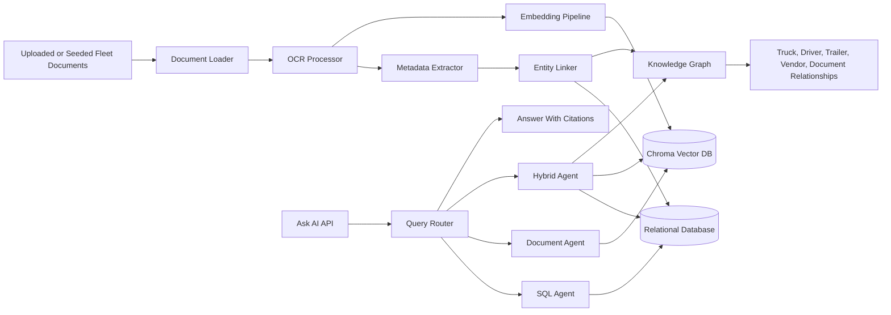

## Folder Structure

```text
fleet-document-intelligence/
│
├── backend/
│   ├── app.py
│   ├── config.py
│   ├── requirements.txt
│   │
│   ├── ingestion/
│   │   ├── document_loader.py
│   │   ├── ocr_processor.py
│   │   ├── metadata_extractor.py
│   │   └── entity_linker.py
│   │
│   ├── database/
│   │   ├── models.py
│   │   ├── db.py
│   │   └── seed_data.py
│   │
│   ├── graph/
│   │   ├── graph_builder.py
│   │   ├── graph_queries.py
│   │   └── graph_schema.py
│   │
│   ├── rag/
│   │   ├── embed_documents.py
│   │   ├── vector_store.py
│   │   ├── retriever.py
│   │   └── answer_generator.py
│   │
│   ├── agents/
│   │   ├── query_router.py
│   │   ├── sql_agent.py
│   │   ├── document_agent.py
│   │   └── hybrid_agent.py
│   │
│   └── api/
│       ├── routes.py
│       └── schemas.py
│
├── frontend/
│   ├── src/
│   │   ├── pages/
│   │   │   ├── Dashboard.jsx
│   │   │   ├── TruckView.jsx
│   │   │   └── AskAI.jsx
│   │   │
│   │   ├── components/
│   │   │   ├── UploadZone.jsx
│   │   │   ├── GraphView.jsx
│   │   │   ├── ChatPanel.jsx
│   │   │   └── DocumentCard.jsx
│   │   │
│   │   └── services/
│   │       └── api.js
│   │
│   └── package.json
│
├── data/
│   ├── raw_documents/
│   │   ├── truck_84/
│   │   │   ├── registration.pdf
│   │   │   ├── title.pdf
│   │   │   ├── maintenance_jan.pdf
│   │   │   └── fuel_receipt_01.jpg
│   │   │
│   │   ├── truck_85/
│   │   └── truck_86/
│   │
│   ├── processed/
│   │   ├── extracted_text/
│   │   ├── metadata/
│   │   └── embeddings/
│   │
│   └── synthetic_data_generator/
│       ├── generate_trucks.py
│       ├── generate_drivers.py
│       ├── generate_trailers.py
│       └── generate_documents.py
│
├── vector_db/
│   └── chroma/
│
├── knowledge_graph/
│   └── graph.json
│
└── docs/
    ├── architecture.md
    ├── schema.md
    └── demo_queries.md
```

### Folder Purpose

* **backend/**: Contains the Flask/FastAPI backend, database models, ingestion pipeline, RAG logic, graph logic, agents, and API routes.
* **frontend/**: Contains the React dashboard, truck views, upload interface, AI chat panel, graph view, and API service calls.
* **data/**: Stores raw synthetic trucking documents, processed text, extracted metadata, embeddings, and data generation scripts for trucks, drivers, trailers, and document history.
* **vector_db/**: Stores the local Chroma vector database used for document retrieval.
* **knowledge_graph/**: Stores graph data linking trucks, drivers, trailers, vendors, documents, and expenses.
* **docs/**: Contains architecture notes, database schema documentation, and demo questions for testing the system.

### Team Ownership

This MVP is split across four teammates so each part can be built on a separate branch and merged cleanly:

* **Yesh / Lead**: AI agents, query routing, `app.py`, and final Ask AI orchestration.
* **Teammate 2**: ingestion pipeline, OCR processing, metadata extraction, entity linking, database models, and seed data.
* **Aryan / RAG and retrieval**: document embeddings, vector store, retriever, answer generation evidence, and knowledge graph relationship retrieval.
* **Teammate 4**: frontend screens, upload UI, API service calls, and synthetic document generation.

Aryan's branch should focus on the RAG/retrieval contract: the system must retrieve the right source documents, preserve citations, support truck/driver/trailer filters, and return "I don't know based on the uploaded documents" when the evidence is missing.

### Architecture



The graph module is intentional, not extra scope. It builds a lightweight knowledge graph across trucks, drivers, trailers, vendors, documents, and expenses so the system can answer relationship questions such as which trailer was tied to Truck 84 during a maintenance event or which driver was associated with an expiring registration.

### Main System Flow

1. Documents are uploaded or generated inside `data/raw_documents/`.
2. The backend ingestion pipeline reads documents using `document_loader.py`.
3. OCR is handled by `ocr_processor.py`.
4. Important fields are extracted using `metadata_extractor.py`.
5. Documents are linked to trucks, drivers, trailers, and vendors using `entity_linker.py`.
6. Structured records are stored in the database.
7. Document text is embedded and stored in the vector database.
8. The knowledge graph connects related entities.
9. The AI agent routes user questions to SQL, document retrieval, or hybrid reasoning.
10. The frontend displays the dashboard, documents, graph relationships, and AI answers with evidence.

### Entity Linking Requirements

Every ingested document is linked to the correct fleet entities when those identifiers appear in the source evidence:

* `truck_id`
* `driver_id`
* `trailer_id`
* `vendor_id`
* `document_id`
* `document_type`
* source page, snippet, or file path

The `POST /ask` request and response schema also supports trailer-aware questions. For example, users can ask about a specific `trailer_id`, or the API can return a linked `trailer_id` when the answer depends on a trailer registration, title, inspection, or maintenance record.

```json
{
  "question": "Which trailers linked to Truck 84 have expiring registrations?",
  "filters": {
    "truck_id": "TRUCK-84",
    "driver_id": null,
    "trailer_id": "TRL-204"
  }
}
```

### Seed Data Scope

The MVP should seed at least 40-50 documents so the demo matches the real fleet workload of 50+ documents per week. The seeded dataset should cover 8-10 document types, including:

* maintenance receipts
* repair invoices
* fuel logs
* fuel receipts
* registrations
* trailer registrations
* titles
* tax forms
* inspection reports
* insurance documents

These documents should be distributed across multiple trucks, drivers, trailers, vendors, dates, and document states so the dashboard and Ask AI workflow feel like a real weekly operations queue instead of a small sample set.

### Realistic Document Messiness

The synthetic document generator should create messy fleet paperwork, not only clean structured PDFs. `generate_documents.py` should include:

* OCR-style typos such as `TRK-084`, `Truck #84`, `Truck84`, and `T-84` referring to the same truck.
* Inconsistent trailer IDs such as `TRL-204`, `Trailer 204`, and `204-T`.
* Mixed date formats such as `06/18/2026`, `June 18, 2026`, and `2026-06-18`.
* Missing or partial fields, especially vendor names, VIN fragments, driver names, and totals.
* Scanned receipt artifacts such as faint totals, duplicated lines, crooked table text, and handwritten-style notes.
* Multi-page PDFs with tables, line items, and page-level citations.

This is important because the system is being judged on whether it can handle realistic trucking documents, including noisy scans and inconsistent fleet naming.

### How We Prevent Hallucinations

The assistant should only answer from retrieved documents or structured database records. If the needed evidence is not found, it returns a clear "I don't know based on the uploaded documents" response instead of guessing.

* Answers include citations with document name, page, and relevant snippet whenever possible.
* Low-confidence retrieval results are treated as missing evidence, not as permission to infer.
* Structured fields such as `truck_id`, `driver_id`, and `trailer_id` must come from extracted metadata or linked records before they appear in an answer.
